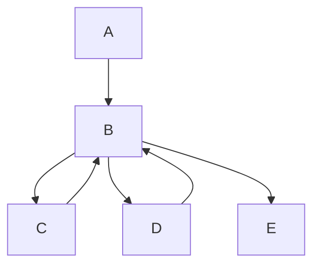

# Emotic.io    Emotic Agentic AI Agent 

This repo contains the Python code for the server side

Get started:

uv venv --python 3.13

source .venv/bin/activate

uv pip install -r pyproject.toml

streamlit run app.py

Typically hosted in a Docker container - TBD: Evaluate if hosting in WASM (Cloudflare Worker) is feasible, implement multitenancy.

### Emotion Basic Vector

## Plutnik
!Plutnik (https://github.com/emotic-io/emotic-avatar/blob/main/plutnik.png

### Architecture:

L | Node
-- | --
A  | Client Browser (WebRTC Camera/Mic)
B  | Emotic Agent
C  | Whisper
D  | LLM: Any [Pydantic AI](https://ai.pydantic.dev/) supported Model (OpenAI, Antrophic, Gemini, Ollama, Deepseek, Groq, Mistral, Cohere)
E  | Client Browser (WebRTC Video/Audio)

### Test Pilot - Agent Render on the server
- Streamlite based Python library exposing Admin API/UI and WebRTC endpoint based on Peon
- A Emotic React Client streams to B Emotic Agent
- B Transcodes forwards audio  to Whisper C   AI Model [Whisper.cpp](https://github.com/ggerganov/whisper.cpp) 
- B recognize emotions and decode emotic stream based on VAD and Plutchik Emotions
- B animates Emotic Avatar in listening mode (for now very basic 2D animation) and stream to Emotic Renderer
- B prompts LLM D with transcoded autio input
- D streams back to B
- B recognizes emotions in the LLM response and decodes emotic stream in sync with Audio
- B animates Emotic Avatar in speech mode and streams over WebRTC to Emotic Renderer on E

###  Future option: Agent Render on the Client  using [Babylon.js](https://Babylon.js)

## Plutchik Emotions - VAD Mapping

Blendshape Mapping
Emotion | Primary Blendshapes
------- | ------------------
Joy	😊 | MouthSmileLeft, MouthSmileRight, CheekSquintLeft, CheekSquintRight
Sadness	😢 | MouthFrownLeft, MouthFrownRight, BrowInnerUp, EyeWideLeft, EyeWideRight
Anger  😠 | BrowDownLeft, BrowDownRight, NoseSneerLeft, NoseSneerRight, JawForward
Surprise 😲 | EyeWideLeft, EyeWideRight, JawOpen, BrowOuterUpLeft, BrowOuterUpRight
Fear 😨 | MouthStretchLeft, MouthStretchRight, JawOpen, EyeSquintLeft, EyeSquintRight
Disgust 🤢 | NoseSneerLeft, NoseSneerRight, MouthPressLeft, MouthPressRight, MouthFunnel
Anticipation 🤔 | BrowOuterUpLeft, BrowOuterUpRight, MouthPressLeft, MouthPressRight

Each blendshape is assigned a weight (0.0 - 1.0) based on emotion intensity.

## Evaluation of render libraries (server and client):
Solution	| WebGL/WebGPU	| Performance	| Real-Time	| WebRTC Compatible
--------- | ------------- | ----------- | --------- | ----------------
Three.js BlendShapes	|  ✅ WebGL	| ⭐⭐⭐ | 	✅ Yes	| ✅ Yes
Babylon.js  WebGPU | 	✅ WebGPU	| ⭐⭐⭐⭐ | 	✅ Yes	| ✅ Yes
MediaPipe Face Mesh	| ❌ (Webcam Tracking)	| ⭐⭐ | 	✅ Yes	| ✅ Yes
WebGPU ML| ✅ WebGPU	| ⭐⭐⭐⭐⭐	| 🚧 Experimental	| ✅ Yes
Unreal Engine Pixel Streaming	| ❌ (Cloud-Based)	| ⭐⭐⭐⭐	| ❌ No (Needs server)	| ✅ Yes

## add packages
example: uv add  streamlit
